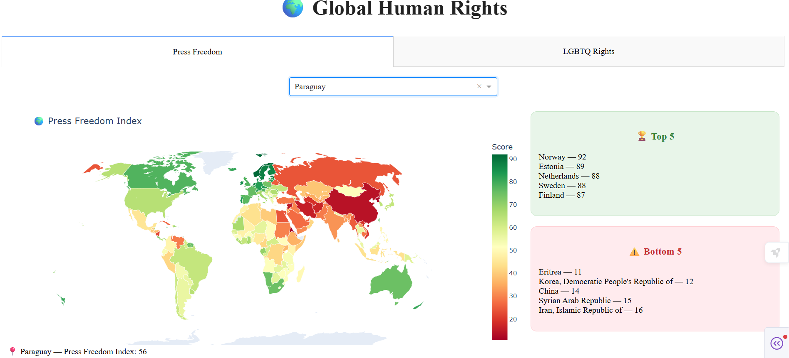

# Global Human Rights Map

An interactive world map that visualizes how countries score on **press freedom** and **LGBTQ+ rights**. Built with Python and Dash, it runs locally in your browser.



## Table of Contents

- [Features](#features)
- [Built With](#built-with)
- [Getting Started](#getting-started)
- [Data](#data)
- [Project Structure](#project-structure)
- [How It Works](#how-it-works)
- [Possible Improvements](#possible-improvements)
- [Author](#author)

## Features

- **Interactive choropleth map** that colors each country by its score (red = lower, green = higher).
- **Two indices, one tab each:**
  - Press Freedom
  - LGBTQ+ Rights
- **Country search:** pick a country from a searchable dropdown to see its score for the active index.
- **Top 5 and Bottom 5:** the highest and lowest scoring countries for the selected index, shown next to the map.
- **Hover tooltips** on the map with the country name and score.

## Built With

- [Python 3](https://www.python.org/)
- [Dash](https://dash.plotly.com/) for the web interface
- [Plotly Express](https://plotly.com/python/plotly-express/) for the map
- [pandas](https://pandas.pydata.org/) for data loading and merging

## Getting Started

### Prerequisites

- Python 3.8 or newer

### Installation

```bash
# 1. Clone the repository
git clone https://github.com/KosXen/HumanRightsMap.git
cd HumanRightsMap

# 2. Create and activate a virtual environment
python -m venv virtenv
virtenv\Scripts\activate        # Windows
# source virtenv/bin/activate   # macOS / Linux

# 3. Install dependencies
pip install -r requirements.txt
```

### Run the app

```bash
python main.py
```

The terminal prints a local address, by default **http://127.0.0.1:8050**. Open it in your browser to see the map.

## Data

The app reads two CSV files from the `data/` folder:

| File | Columns used | Description |
|---|---|---|
| `freedom_stats.csv` | `country`, `ISO`, `Score` | Press freedom score per country |
| `lgbtq_rights.csv` | `ISO`, `lgbtq_rights` | LGBTQ+ rights score per country |

The two datasets are joined on the country's **ISO code**. Countries missing from the LGBTQ+ dataset appear without a score on that tab.

**Sources:** 

- Press Freedom from Reporters Without Borders report, 2025

## Project Structure

```
.
├── main.py              # Dash app: data loading, layout and callbacks
├── requirements.txt     # Python dependencies
└── data/
    ├── freedom_stats.csv
    └── lgbtq_rights.csv
```

## How It Works

1. **Load and merge:** both CSV files are read with pandas and merged on the ISO code.
2. **Layout:** the page has a title and two tabs. The content under the tabs is generated by a callback.
3. **Tab callback:** when a tab is selected, the app builds the country dropdown, the choropleth map, and the Top 5 / Bottom 5 lists for that index.
4. **Country callback:** when a country is chosen in the dropdown, its name and score for the active index are displayed under the map.

## Author

**KOSTAS XENAKOUDIS**
[GitHub](https://github.com/KosXen) | [LinkedIn](https://www.linkedin.com/in/kostas-xenakoudis-851134228/)
